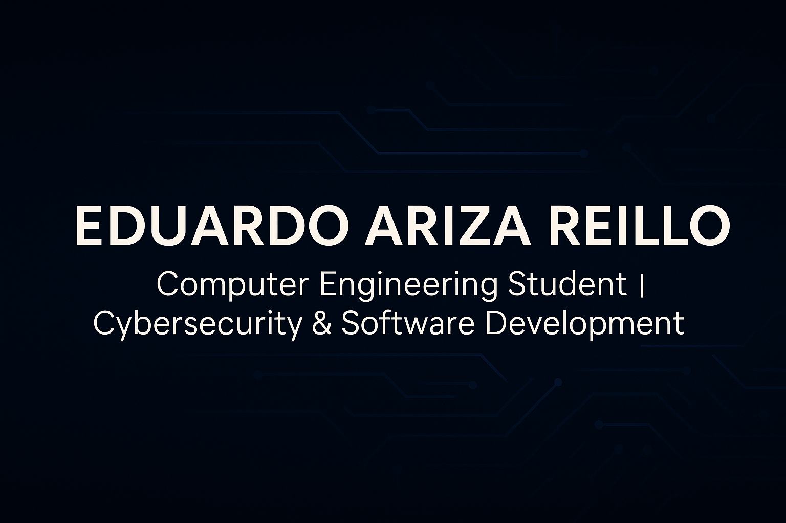

<!-- Banner -->

# 👋 Competencias

🎓 Estudiante de **Ingeniería Informática**  
💻 Trabajo actualmente en **GSyA (Grupo de Investigación en Ciberseguridad)** y en **SevenWeeks**  
📱 Grado Superior en **Desarrollo de Aplicaciones Multiplataforma (DAM)**  
🏢 Experiencia en prácticas en **Indra** y **Munity**  
🌍 Idiomas: **Español nativo** | **Inglés C1 (Aptis)**  
🤝 Persona **sociable, proactiva** y con gran capacidad de trabajo en equipo  
🚀 Apasionado por el desarrollo de software, la tecnología y la innovación  

---

## 🛠️ Tecnologías que uso  

---

## 🌱 Actualmente aprendiendo  

🔐 **Seguridad y Ciberseguridad**
- Aplicación de las **Normas ENS** (Esquema Nacional de Seguridad)  
- Marcos europeos como **ENISA** y **EASA** para gestión de riesgos  
- Cumplimiento y auditorías según la **familia ISO 27000** (Gestión de la Seguridad de la Información)  

🏗️ **Arquitectura y Buenas Prácticas**
- Diseño de software seguro desde el inicio (Security by Design)  
- **Arquitectura empresarial** siguiendo estándares internacionales  
- Implementación de **ISO 42000** para inteligencia artificial y sistemas avanzados  

⚙️ **DevOps & Cloud**
- Automatización de despliegues en la nube  
- Contenerización con Docker y orquestación  
- Integración de pipelines seguros (CI/CD con enfoque en seguridad)  

---

### 📊 Normativas y Estándares que estudio

  
  
  
  
  

---

## 🎮 Sobre mí  

  
  
  
  

### Un poco más sobre mí
- 👾 Soy un auténtico **friki de los videojuegos de terror**, disfruto explorando atmósferas oscuras y desafiantes.  
- 🚶‍♂️ Me encanta **caminar** y perderme por nuevas rutas.  
- 🏔️ Practico **montañismo**, porque la montaña es esfuerzo, silencio y superación.  
- 🌿 Tengo una conexión profunda con la **naturaleza y los animales**: me inspiran paz, respeto y equilibrio.  

> *“La tecnología es mi pasión, pero la naturaleza y la aventura son mi refugio.”*

## 📫 Cómo contactarme
- ✉️ Email: arizareilloeduardo@gmail.com  
- 💼 LinkedIn: ([https://www.linkedin.com/in/eduardo-ariza-reillo](https://www.linkedin.com/in/eduardo-ariza-reillo-7a880b21a/))

---

  

